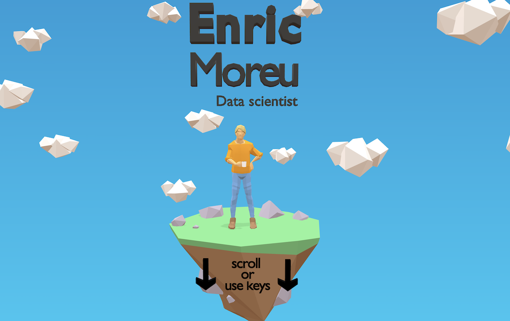

<span style="font-size: 24px;">Link: <a target="_blank" href="https://enricmor.eu" style="font-size: 24px;">www.enricmor.eu</a></span>

<div style="text-align: center;">
    
</div>

# 3D Resume - Next.js Version

A modern 3D interactive resume built with Next.js and Three.js, allowing users to explore your professional journey by scrolling through 3D scenes.

## Getting Started

First, install dependencies:

```bash
npm install
```

Then, run the development server:

```bash
npm run dev
```

Open [http://localhost:3000](http://localhost:3000) with your browser to see the 3D resume.

## How to create your own 3D resume

### Prerequisites

- Basic understanding of TypeScript/React and Next.js
- Interest in learning 3D modeling with Blender
- A GitHub account (for hosting your resume)

### Step 1: Setting up your environment

Clone this repository and install dependencies:

```bash
npm install
npm run dev
```

Open your web browser and go to `localhost:3000` to see the website.

### Step 2: Learn some Blender basics

Your initial focus should be on learning some Blender. It will likely consume the bulk of your time but it's totally worth it. Here are some [video tutorials](https://www.youtube.com/watch?v=1jHUY3qoBu8).

#### Tips:
- Spend some time watching Blender videos and practicing before trying to build your resume. Make sure you learn all the useful shortcuts and Blender operations.
- Sketch your design on paper, this will help you visualise the multiple scenes.
- Stick to a low-poly design where possible, as it's easier to manage and loads faster.
- Use a standard colour palette, like [this one](https://coolors.co/2176ae-57b8ff-b66d0d-fbb13c-fe6847).
- Use a rigged model like [this one](https://www.youtube.com/watch?v=mnP54h3x6_Y) to display your persona.
- Optionally, you can add simple animations to the 3D scene to make it more dynamic.

You can download Blender [here](https://www.blender.org/download/).

### Step 3: Create your 3D models

Each scene is composed of a 3D model. By default they are nested with a scale shift of 100.

Once you're satisfied with your 3D model, you can proceed to export it. Use the following settings:
- **Format**: GLTF
- **File Path**: `public/models/model.glb`

Important: add your model names in the `modelNames` array in `src/components/ThreeScene.tsx`. They will be presented in this order.

After exporting, the Next.js dev server will automatically pick up the new models. Refresh your browser to see your model. Before going to the next step, make sure that the website looks good in different viewports (smartphone, tablet, desktop).

### Step 4 (optional): Compress the 3D model to reduce loading time

In order to make the GLTF model lighter, [install the Draco encoder](https://github.com/CesiumGS/gltf-pipeline):

```bash
npm install -g gltf-pipeline
```

Then run the compression script:

```bash
./compress_models.sh
```

This will compress all models in `public/models/` using Draco compression, significantly reducing file sizes and improving load times.

### Step 5: Customize your content

Update the following files to personalize your resume:
- `src/components/ThreeScene.tsx`: Adjust constants and model names
- `src/components/Footer.tsx`: Update your social links
- `src/app/layout.tsx`: Update metadata, Open Graph tags, and personal information

### Step 6: Deploy on Vercel

Deploy your Next.js 3D resume using the [Vercel Platform](https://vercel.com/new):

1. Push your code to GitHub
2. Import your repository on Vercel
3. Vercel will automatically detect Next.js and deploy

Check out the [Next.js deployment documentation](https://nextjs.org/docs/app/building-your-application/deploying) for more details.

## Technical Stack

- **Next.js 16**: Modern React framework
- **Three.js 0.181.0**: 3D graphics library
- **TypeScript**: Type-safe development
- **Tailwind CSS**: Utility-first styling
- **Draco Loader**: Compressed 3D model loading

## Project Structure

```
resume_v2/
├── src/
│   ├── app/
│   │   ├── layout.tsx          # Root layout with metadata
│   │   ├── page.tsx            # Main page component
│   │   └── globals.css         # Global styles
│   └── components/
│       ├── ThreeScene.tsx      # Main Three.js scene component
│       └── Footer.tsx          # Social links footer
├── public/
│   ├── models/                 # 3D GLB model files
│   ├── favicon.png            # Site favicon
│   └── preview.png            # Preview image
└── package.json
```

## Learn More

- [Next.js Documentation](https://nextjs.org/docs)
- [Three.js Documentation](https://threejs.org/docs/)
- [Blender Tutorials](https://www.youtube.com/watch?v=1jHUY3qoBu8)
